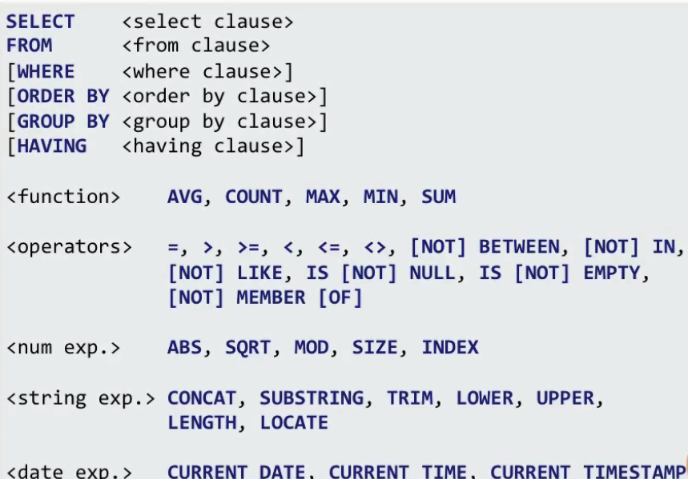
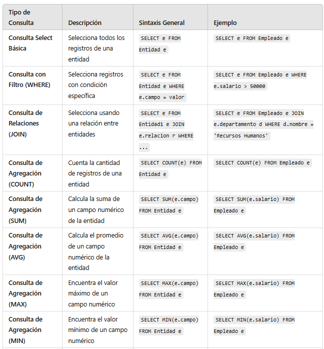

# JPQL - Jakarta Persistence Query Language



```
@Entity
public class Empleado {
    @Id
    private Long id;
    private String nombre;
    private Double salario;

    @ManyToOne
    private Departamento departamento;
}

@Entity
public class Departamento {
    @Id
    private Long id;
    private String nombre;

    @OneToMany(mappedBy = "departamento")
    private List<Empleado> empleados;
}

```



